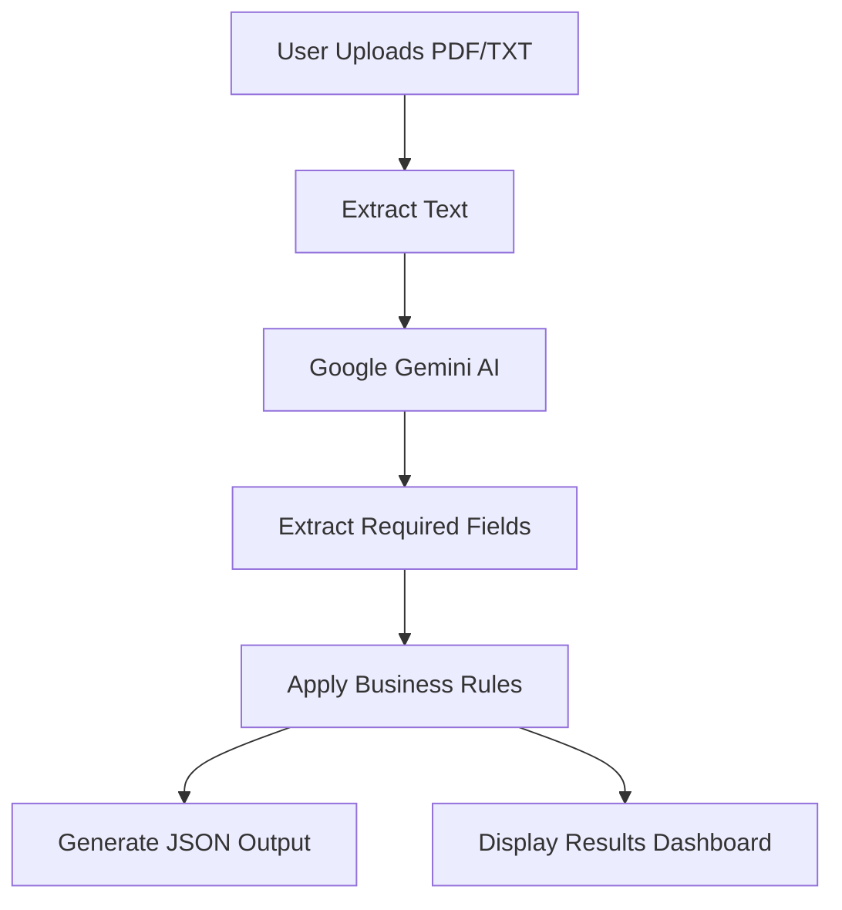

# ✈️ ClaimPilot AI

> **Autonomous Insurance Claims Ingestion & Routing Agent**

[](https://github.com/umasuryateja/ClaimPilot-AI)
[](https://www.python.org/)
[](https://streamlit.io/)
[](https://deepmind.google/technologies/gemini/)
[](LICENSE) .

ClaimPilot AI is a production-grade Document AI agent that automates the extraction, validation, and routing of First Notice of Loss (FNOL) documents. By replacing manual classification workflows with structured, zero-click extraction powered by Google Gemini, ClaimPilot AI extracts policy and incident metrics, checks data integrity via Pydantic, and routes claims dynamically using a prioritized rule engine.

---

## 📐 Architecture Workflow

The ingestion and routing pipeline runs fully stateless in the following sequence:



---

## 🚀 Key Features

* **📦 Unified PDF/TXT File Upload**: Drag-and-drop file uploader supporting both machine-readable PDFs, raw text emails, and scanned image logs.
* **🧠 Deterministic AI Extraction**: Utilizes `gemini-2.5-flash` at `temperature = 0.0` to extract 16 discrete policy, incident, party, and asset fields.
* **👁️ Automated OCR Fallback**: Standard PDF parser fallback to Tesseract OCR via `pdf2image` and `pytesseract` if scanned or image-based PDFs are uploaded.
* **🛡️ Pydantic Data Sanitization**: Cleans currency symbols, Normalizes formatting delimiters, strips commas, and executes business validation checks (e.g. invalid dates, negative financial claims, and incident dates outside policy limits).
* **🔀 Priority-Based Rule Engine**: Categorizes and routes claims automatically based on business logic: `Investigation` > `Manual Review` > `Specialist Queue` > `Fast-track` > `Standard Review`.
* **📊 Visual Ingestion Analytics**: Tracks data completeness scores dynamically and visualizes them on a modern, colored progress card.
* **💾 Standardized JSON Export**: View and download the structured 4-key JSON schema (`extractedFields`, `missingFields`, `recommendedRoute`, `reasoning`) in a single click.

---

## 📂 Repository structure

```
ClaimPilot AI/
├── .streamlit/
│   └── config.toml          # Streamlit theme configurations
├── sample_documents/       # Predefined test claim files
├── tests/                  # Pytest unit tests
│   ├── test_extractor.py
│   ├── test_models.py
│   └── test_rule_engine.py
├── app.py                  # Main Streamlit web dashboard
├── extractor.py            # PDF and TXT text extraction logic (OCR fallback)
├── gemini_parser.py        # Gemini API integrations and brace JSON cleaner
├── generate_sample_docs.py # Sample PDF/TXT documents generator utility
├── models.py               # Pydantic data schemas & custom field validators
├── prompts.py              # LLM system instructions template
├── rule_engine.py          # Priority-based routing decision rules
├── theme.py                # Streamlit custom UI styling
├── utils.py                # Configs, logging setup, and CSS sheets
├── .env.example            # Environment variables configuration template
├── .gitignore              # Files excluded from Git tracking
├── LICENSE                 # MIT License file
├── render.yaml             # Render deployment configuration
└── requirements.txt        # Pinned python project dependencies
```

---

## ⚙️ Installation & Setup

### Prerequisites
* Python 3.10+
* Tesseract OCR (required only for scanned image PDF parsing)
* Poppler (required by pdf2image for scanned PDF image conversion)

### Step-by-Step Installation

1. **Clone the Repository**:
   ```bash
   git clone https://github.com/umasuryateja/ClaimPilot-AI.git
   cd ClaimPilot-AI
   ```

2. **Set Up a Virtual Environment**:
   ```bash
   python -m venv venv
   # On Windows:
   .\venv\Scripts\activate
   # On macOS/Linux:
   source venv/bin/activate
   ```

3. **Install Required Packages**:
   ```bash
   pip install -r requirements.txt
   ```

4. **Generate Test Documents**:
   Compile the 5 sample claim files (fast-track, manual review, scanned, injury, and investigation) to test the app instantly:
   ```bash
   python generate_sample_docs.py
   ```

5. **Configure Environment Variables**:
   Create a `.env` file in the root directory:
   ```env
   GEMINI_API_KEY=your_actual_gemini_api_key_here
   ```

6. **Run Streamlit Locally**:
   ```bash
   streamlit run app.py
   ```
   Open your browser and navigate to `http://localhost:8501`.

---

## 🎛️ Business Routing Rules

The claims are classified by the Priority Routing Engine into 5 workflow pathways:

| Recommended Route | Trigger Conditions (Prioritized top-to-bottom) | Color Code |
| :--- | :--- | :--- |
| **Investigation** | Incident description mentions potential fraud patterns or staged crash warnings. | `Red` (🔴) |
| **Manual Review** | Missing any of the 12 mandatory fields (e.g. policy number, claimant name, incident location). | `Orange` (🟠) |
| **Specialist Queue** | Claim description mentions physical injury or claim type is classified as `"Injury"`. | `Blue` (🔵) |
| **Fast-track** | Estimated damage or Initial loss estimate is less than `$25,000` (Collision/Theft/Property). | `Green` (🟢) |
| **Standard Review** | All mandatory fields are present, no injury, and estimate is `$25,000` or above. | `Gray` (⚪) |

---

## 💾 Example JSON Output

The system produces a standardized machine-readable JSON structure conforming to the following 4-key schema:

```json
{
  "extractedFields": {
    "policy_number": "POL-998877",
    "policyholder_name": "Sarah Miller",
    "effective_dates": "2026-01-01 to 2026-12-31",
    "incident_date": "2026-06-15",
    "incident_time": "08:15",
    "incident_location": "Route 9, Boston, MA",
    "incident_description": "Rear-end collision occurred on Route 9, Boston. Claimant reports neck soreness.",
    "claimant": "Sarah Miller",
    "third_parties": "James Carter",
    "contact_details": "sarah.miller@email.com",
    "asset_type": "Vehicle",
    "asset_id": "Honda Civic (License Plate: MA-9092)",
    "estimated_damage": 12000.0,
    "claim_type": "Injury",
    "attachments": [],
    "initial_estimate": 15000.0
  },
  "missingFields": [],
  "recommendedRoute": "Specialist Queue",
  "reasoning": "Claim routed to Specialist Queue because the incident description mentions physical injury ('neck soreness') or the claim type is Injury."
}
```

---

## 🛡️ Error Handling Details

* **Invalid PDF/TXT File**: Halts immediately with a clear alert if the file is corrupted or contains unrecognized formatting.
* **Empty Document**: Performs a pre-flight content check; if the file contains no text, the system halts before reaching the Gemini API to save costs.
* **OCR Failures**: Gracefully catches missing binary warnings (like Poppler or Tesseract not installed) and displays user-friendly installation instructions.
* **Gemini API Failures**: Implements a 2-retry exponential backoff configuration. If all attempts fail (e.g. rate limit, auth errors), it shows the details.
* **Invalid JSON Structure**: Removes markdown code blocks and isolates the outermost braces `{ ... }` using boundary regex, avoiding failures due to conversational wrapper texts.

---

## 🔮 Future Improvements

1. **🔒 Enterprise Authentication**: Implement Role-Based Access Control (RBAC) for adjusters and supervisors.
2. **🗄️ Database Integration**: Support claims auditing, status histories, and historical trend lookups.
3. **🌐 RESTful API Endpoints**: Expose routing engines via FastAPI to support automated claims systems.
4. **🎯 LLM Confidence Scores**: Return token-level probability scores to flag low-confidence extractions.
5. **📁 Cloud Storage**: Support direct upload streams to secure AWS S3, Azure Blob, or Google Cloud Storage.

---

## ☁️ Deployment (Render)

This repository includes a `render.yaml` template configured for easy deployment on [Render](https://render.com/):

* **Service Type**: `Web Service`
* **Environment**: `Python`
* **Build Command**: `pip install -r requirements.txt`
* **Start Command**: `streamlit run app.py --server.port $PORT --server.address 0.0.0.0`
* **Environment Variables**: Define `GEMINI_API_KEY` under the service's Environment panel.

---

## 🤝 Contributing

Contributions are welcome! Please follow these guidelines:
1. Fork the repository.
2. Create a new branch: `git checkout -b feature/your-feature-name`.
3. Make your changes and commit: `git commit -m "feat: Add your feature description"`.
4. Push to the branch: `git push origin feature/your-feature-name`.
5. Open a Pull Request.

Ensure all modifications are fully verified by running:
```bash
pytest tests/
```

---

## 📝 License

Distributed under the MIT License. See [LICENSE](LICENSE) for more details.

---

## 👥 Developer & Contact

Developed with ❤️ by **Jakka Uma Surya Teja**

* **GitHub**: [umasuryateja](https://github.com/umasuryateja)
* **LinkedIn**: [surya-teja-jakka](https://www.linkedin.com/in/umasuryateja/)
* **Portfolio**: [surya-portfolio](https://surya-teja-portfolio-dun.vercel.app/)
